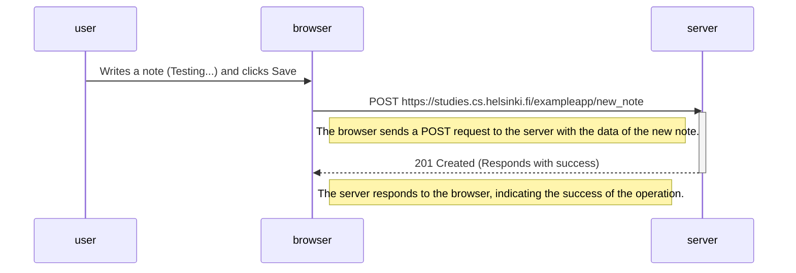

```mermaid
sequenceDiagram
  participant user
  participant browser
  participant server

  user ->> browser: Writes a note (Testing...) and clicks Save
  browser ->> server: POST https://studies.cs.helsinki.fi/exampleapp/new_note
  activate server

Note right of browser: The browser sends a POST request to the server with the data of the new note.

  server -->> browser: 201 Created (Responds with success)
  deactivate server

Note right of browser: The server responds to the browser, indicating the success of the operation.

```
