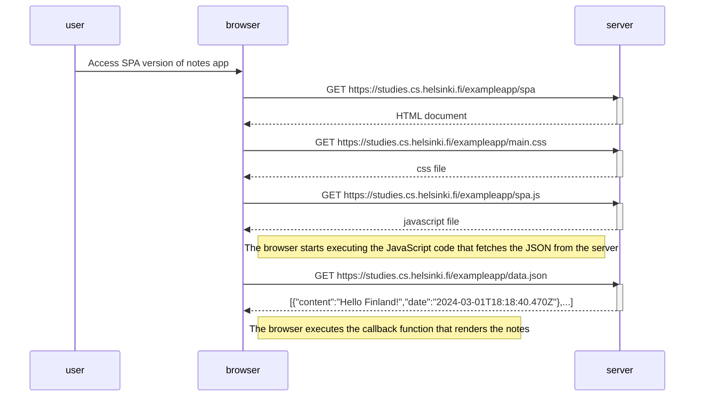

```mermaid
sequenceDiagram
  participant user
  participant browser
  participant server

user ->> browser: Access SPA version of notes app

browser ->> server: GET https://studies.cs.helsinki.fi/exampleapp/spa
activate server
server -->> browser: HTML document
deactivate server

browser ->> server: GET https://studies.cs.helsinki.fi/exampleapp/main.css
activate server
server -->> browser: css file
deactivate server

browser ->> server: GET https://studies.cs.helsinki.fi/exampleapp/spa.js
activate server
server -->> browser: javascript file
deactivate server

  Note right of browser: The browser starts executing the JavaScript code that fetches the JSON from the server

browser ->> server: GET https://studies.cs.helsinki.fi/exampleapp/data.json
activate server
server -->> browser: [{"content":"Hello Finland!","date":"2024-03-01T18:18:40.470Z"},...]
deactivate server

  Note right of browser: The browser executes the callback function that renders the notes
```
