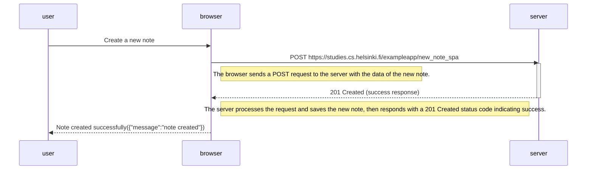

```mermaid
sequenceDiagram
  participant user
  participant browser
  participant server

  user ->> browser: Create a new note

  browser ->> server: POST https://studies.cs.helsinki.fi/exampleapp/new_note_spa
  activate server

Note right of browser: The browser sends a POST request to the server with the data of the new note.

  server -->> browser: 201 Created (success response)
  deactivate server

Note left of server: The server processes the request and saves the new note, then responds with a 201 Created status code indicating success.

  browser -->> user: Note created successfully({"message":"note created"})
```
